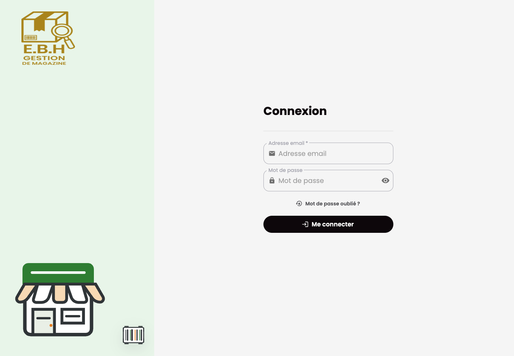

# Gestion Magasin Frontend

## Purpose

Gestion Magasin Frontend is the Next.js dashboard for store operations, including catalog, stock, sales, purchases, point of sale, finance, attendance, reporting, settings, and notifications.

## Stack

- Next.js and React
- TypeScript
- NextAuth
- Redux Toolkit and redux-saga
- MUI, Sass, and chart components
- Formik and Zod
- Jest and Testing Library

## Features

- Inventory, store stock, and transfer screens
- Catalog, sales, purchase, and point-of-sale workflows
- Promotion and reporting views
- Finance and attendance screens
- User administration and profile settings
- Notifications and maintenance status handling

## Setup

Provide local-only variables for the API, auth, and websocket endpoints. Use localhost values for local development and do not commit local configuration files.

```bash
bun install
bun run dev
```

The frontend runs on `localhost:3006`.

## Tests

```bash
bun x jest --runInBand --coverage=false
bun run lint
bun run build
```

## Screenshot


