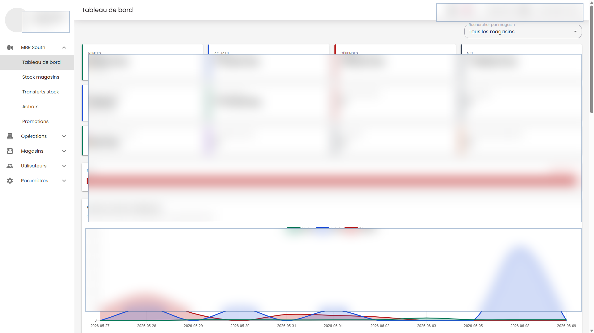
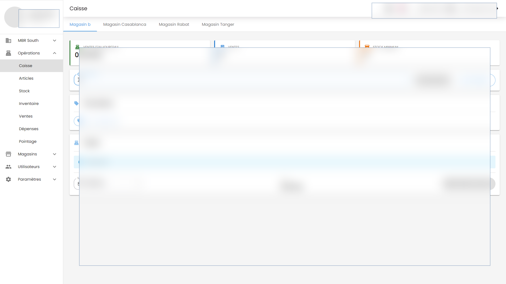
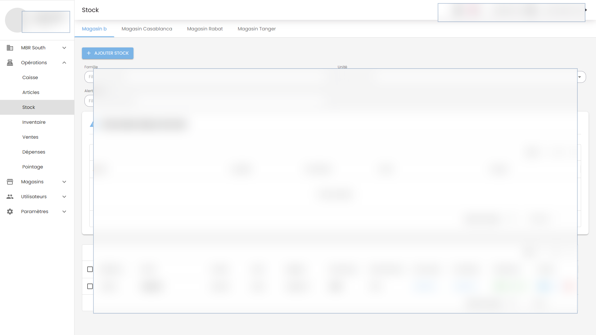

# Gestion Magasin Frontend

Next.js interface for a store operations platform for catalog, stock, store inventory, purchases, sales, cash register, promotions, expenses, attendance, reporting, users, notifications, and multi-store workflows.

This frontend is built around real staff workflows: authenticated navigation, dense dashboards, tables, filters, create/edit/detail pages, forms, actions, settings, notifications, and production data constraints.

## What It Shows

- Product UI work for an internal business system.
- Data-heavy React/Next.js screens with real workflow depth.
- State management with Redux Toolkit and redux-saga.
- Authenticated app structure with NextAuth and API-backed routes.
- Form, table, dashboard, notification, and settings flows built for daily operations.

## Key Capabilities

- Next.js dashboard for articles, stock, inventory, store stock, stock transfers, purchases, sales, caisse, promotions, expenses, attendance, stores, users, and settings.
- MUI data grids, store tabs, filters, forms, date pickers, dashboards, action controls, and reporting-oriented pages.
- Redux Toolkit and redux-saga state flows across catalog, sales, purchases, stock, users, auth, and notifications.
- Formik/Zod forms for stock movements, sales, purchases, attendance, expenses, promotions, stores, and users.
- Jest and Testing Library tooling for UI behavior and state logic.

## Stack

- Next.js 16, React 19, TypeScript
- NextAuth, Axios, React Redux
- Redux Toolkit, redux-saga
- MUI, MUI X Data Grid, Sass, chart components
- Formik, Zod, date-fns
- Jest, Testing Library, ts-jest, Bun

## Related Repository

- Backend API: [Altroo/gestion_magasin_backend](https://github.com/Altroo/gestion_magasin_backend)

## Screenshots

Redacted production screenshots. Sensitive names, amounts, dates, and records are blurred.







## Local Setup

Create local-only environment variables for the API base URL, auth settings, websocket endpoints, and public runtime config. Do not commit `.env` files or production credentials.

```bash
bun install
bun run dev
```

Default local port: `3006`.

## Quality Checks

```bash
bun x jest --runInBand --coverage=false
bun run lint
bun run build
```

## Windows POS-80 Setup

The ticket uses a compact 68 mm layout on 80 mm paper. On the Windows caisse machine:

1. Install the **POSPrinter WDLink WD8260** driver. The device must appear under **Printers & scanners**, not only Device Manager.
2. Select 80 mm roll paper in its printing preferences and print a Windows test page.
3. Create a desktop shortcut that runs `deploy/windows/launch-caisse.ps1` with PowerShell.

The launcher sets the detected WD8260/POS-80 queue as the Windows default printer, then starts a dedicated Chrome caisse profile with `--kiosk --kiosk-printing`. It does not change browser policies. The seller signs in once, then all tickets print to the POS-80 without preview or “Save as PDF.”

## Portfolio Note

The repository is public for portfolio review. Screenshots are redacted, and sensitive production values are intentionally hidden.
